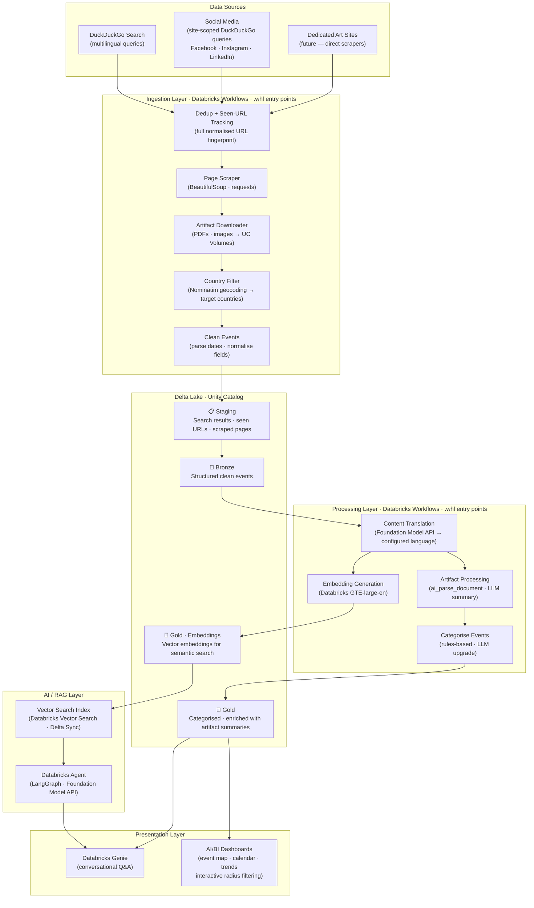

# ArtLake — Project Architecture

## Overview

ArtLake is an automated event discovery platform for professional artists. It scrapes the internet for open calls, art markets, exhibitions, and other painter-relevant events in **English, Dutch, German, and French**, filters them by a configurable **list of target countries**, and makes the data queryable via **natural language** using Databricks Genie and surfaced in **AI/BI dashboards**. Distance-based radius filtering is available interactively in the BI layer.

---

## High-Level Architecture



---

## Component Description

### Data Sources

| Source | What we collect | Notes |
|---|---|---|
| DuckDuckGo Search | Open calls, events, art fairs — via multilingual search queries per language × category × country | `duckduckgo-search` library, free, no API key (ADR-001) |
| Social media (site-scoped) | Public events from Facebook, Instagram, LinkedIn — via `site:` DuckDuckGo queries | Compliant approach per ADR-002 |
| Dedicated art sites *(future)* | Direct scraping of platforms like Entrée, Artsy, Kunstenpunt, etc. | Added when discovered |

### Ingestion Layer

Orchestrated as **Databricks Workflows**. Each step is a `.whl` entry point executed via `python_wheel_task` — no notebooks, no Python-level orchestration (ADR-012, ADR-017).

- **Query generation** (`artlake-generate-queries`) — translates base English keywords to NL/DE/FR via LLM; writes `queries.yml` (bundled with DAB artifacts) with one query per language × category × country. Runs once before search; re-run only when keywords change.
- **Search** (`artlake-search`, `artlake-search-social`) — reads pre-generated `queries.yml` and executes each query via `duckduckgo-search`. Results tagged with query language. Country names already included in queries (from generation step).
- **Dedup + Seen-URL Tracking** (`artlake-dedup`) — fingerprints each URL with `sha2(url, 256)` and anti-joins against `artlake.staging.seen_urls`. Writes only unseen URLs to `seen_urls`, making it a persistent set across pipeline runs. Supports art aggregators where the domain is the same but event paths differ (each path produces a distinct hash).
- **Page Scraper** (`artlake-scrape-pages`) — `requests` + BeautifulSoup for HTML content extraction. Detects PDF/image links (open call rules, posters, flyers). Upgrade path: SerpAPI (paid) when JS-rendered pages or richer content extraction is needed.
- **Artifact Downloader** (`artlake-download-artifacts`) — downloads detected PDFs and images to Unity Catalog Volumes.
- **Country Filter** (`artlake-geocode`) — resolves event location to lat/lng/country via Nominatim (ADR-003). Filters by configurable `target_countries`. Lat/lng stored for future BI-layer radius filtering. No radius filter at ingestion (ADR-013).
- **Clean Events** (`artlake-clean-events`) — parses dates, normalises fields, writes structured `CleanEvent` records to Bronze.

**Note:** Language filtering is handled at the search query level (queries generated per target language), not as a separate pipeline step (ADR-004 updated).

### Delta Lake (Unity Catalog)

| Layer | Table | Content |
|---|---|---|
| Staging | `artlake.staging.search_results` | Raw search results, tagged with query language and source. |
| Staging | `artlake.staging.seen_urls` | All URLs written by dedup — presence = seen. Persists across runs. Schema: url, title, source, fingerprint (sha2), ingested_at. |
| Staging | `artlake.staging.scraped_pages` | Extracted page content, artifact URLs. `processing_status` column. |
| Staging | `artlake.staging.artifacts` | Artifact metadata and UC Volume file paths. `processing_status` column. |
| Bronze | `artlake.bronze.raw_events` | Structured clean events (title, description, dates, location, lat/lng, country, language, source, url) — original language |
| Bronze | `artlake.bronze.translated_events` | Events translated to configured language (default: English) |
| Gold | `artlake.gold.events` | Categorised (open_call / market / exhibition / workshop / other), enriched with artifact summaries |
| Gold | `artlake.gold.embeddings` | Vector embeddings for semantic search (Delta Sync to Vector Search) — from translated content |

**`processing_status`** — used on staging tables for expensive operations (`scraped_pages`, `artifacts`) to track row-level progress: `new` → `processing` → `done` | `failed`. Not used on `search_results` or `seen_urls` — those tables use simpler coordination (anti-join on `seen_urls`, presence in `scraped_pages`).

### Processing Layer

Orchestrated as **Databricks Workflows** with `python_wheel_task` entry points.

- **Content Translation** (`artlake-translate`) — translates event content (title, description, location) to configured language (default: English) via Foundation Model API. Eliminates the need for multilingual embeddings and simplifies downstream categorisation.
- **Artifact Processing** (`artlake-process-artifacts`) — `ai_parse_document` (Databricks-native SQL function) for PDF text extraction and image OCR. LLM-generated structured summaries (deadline, requirements, location, fees) via Foundation Model API.
- **Event Categorisation** — two approaches, same input/output contract:
  - Rule-based (`artlake-categorise-rules`) — keyword matching on translated content (MVP)
  - LLM-based (`artlake-categorise-llm`) — Foundation Model API classification (upgrade, drop-in replacement)
- **Embedding Generation** (`artlake-embed`) — GTE-large-en via Databricks Foundation Model API. Works well because content is pre-translated to English. Stored in Delta for Vector Search sync.

### AI / RAG Layer

- **Embedding model** — Databricks Foundation Model API (GTE-large-en) applied to translated event descriptions (ADR-005).
- **Vector Search** — Databricks Vector Search with Delta Sync index over embeddings, enabling semantic retrieval (ADR-006).
- **RAG pipeline** — retrieves relevant events and feeds them as context into a Databricks AI agent *(Phase 3)*.
- **Databricks Agent** — reasons over retrieved context to answer natural-language questions *(Phase 3)* such as:
  - *"Any open calls for oil painters in Belgium next month?"*
  - *"What art markets are within 100 km of postal code 2000 in April?"*

### Presentation Layer *(Phase 3)*

- **Databricks Genie Workspace** — conversational interface backed by both the Gold table (SQL) and the RAG agent.
- **AI/BI Dashboards** — visual overview including:
  - Event map (plotted by lat/lng)
  - Calendar view of upcoming events
  - Trend charts (events by category, language, country)
  - Source breakdown
  - **Interactive radius filtering** — user selects a postal code and distance range

---

## Detailed Drawings

> Excalidraw drawings are maintained in this folder:
>
> - [`high-level-architecture.excalidraw`](./high-level-architecture.excalidraw) — full high-level architecture (mirrors the Mermaid diagram above)
> - `ingestion-detail.excalidraw` *(planned)* — scraper internals, geo/language filtering pipeline
> - `rag-detail.excalidraw` *(planned)* — embedding, vector search, and agent reasoning flow
> - `delta-schema.excalidraw` *(planned)* — Bronze / Silver / Gold table schemas

---

## Configuration

The artist configures the system via `ArtLakeConfig` (Pydantic v2 model), loaded from DAB variables or a bundled YAML file deployed with DAB artifacts:

```python
config = ArtLakeConfig(
    target_countries=["NL", "BE", "DE", "FR"],
    languages=["en", "nl", "de", "fr"],
    target_language="en",  # all content translated to this language
    categories=["open_call", "market", "exhibition", "workshop"],
    scrape_schedule="0 6 * * *",   # daily at 06:00 UTC
)
```

**Note:** `radius_km` and `home_postal_code` are Phase 3 (BI layer) concerns — the user sets these interactively in dashboards/Genie, not in the pipeline config.

---

## Technology Stack

| Layer | Technology |
|---|---|
| Execution model | `.whl` entry points via `python_wheel_task` (no notebooks for processing) |
| Orchestration | Databricks Workflows (sole orchestrator — no Python-level orchestration) |
| Deployment | Databricks Asset Bundles (DAB-native, no custom parameters) |
| Search | `duckduckgo-search` (free, no API key) |
| Scraping | `requests` + `beautifulsoup4` (SerpAPI upgrade path) |
| Geocoding | Nominatim / `geopy` (free, no API key) |
| Artifact processing | `ai_parse_document` (Databricks-native SQL function for PDF + image) |
| Storage | Delta Lake + Unity Catalog (structured), UC Volumes (artifacts) |
| Content translation | Databricks Foundation Model API (LLM) — translate to configured language |
| Embeddings | Databricks Foundation Model API (GTE-large-en, on pre-translated content) |
| Vector search | Databricks Vector Search (Delta Sync) |
| LLM | Databricks Foundation Model API (categorisation, artifact summaries) |
| RAG / Agents | Databricks Agent Framework + MLflow + LangGraph *(Phase 3)* |
| NL interface | Databricks Genie (AI/BI) *(Phase 3)* |
| Dashboards | Databricks AI/BI Dashboards *(Phase 3)* |
