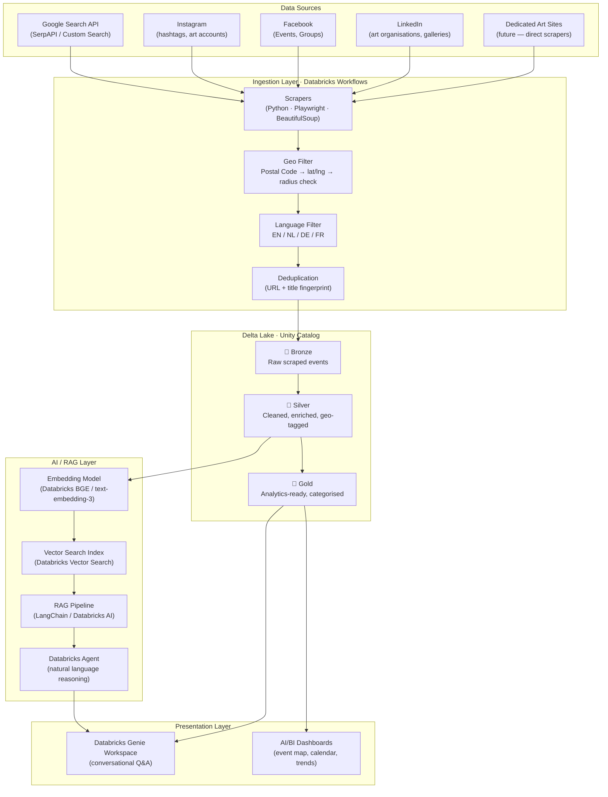

# ArtLake — Project Architecture

## Overview

ArtLake is an automated event discovery platform for professional artists. It scrapes the internet for open calls, art markets, exhibitions, and other painter-relevant events in **English, Dutch, German, and French**, filters them by a configurable **geographical radius from a postal code**, and makes the data queryable via **natural language** using Databricks Genie and surfaced in **AI/BI dashboards**.

---

## High-Level Architecture



---

## Component Description

### Data Sources

| Source | What we collect | Notes |
|---|---|---|
| Google Search API | Open calls, events, art fairs — via targeted search queries per language | SerpAPI or Google Custom Search |
| Instagram | Posts tagged with art event hashtags (`#opencall`, `#kunstmarkt`, etc.) | Graph API / scraping |
| Facebook | Public events from art galleries, cultural organisations | Events API / scraping |
| LinkedIn | Posts and events from art organisations and galleries | Scraping |
| Dedicated art sites *(future)* | Direct scraping of platforms like Entrée, Artsy, Kunstenpunt, etc. | Added when discovered |

### Ingestion Layer

Orchestrated as **Databricks Workflows** (scheduled + triggered):

- **Scrapers** — Python-based, using Playwright for JS-heavy pages and BeautifulSoup for static HTML. One scraper module per source.
- **Geo Filter** — resolves the artist's postal code to lat/lng (OpenCage / Google Geocoding API), then filters events by distance using the Haversine formula.
- **Language Filter** — detects language using `langdetect` / `lingua`; retains EN, NL, DE, FR only.
- **Deduplication** — fingerprints each event on URL + normalised title to avoid re-ingesting duplicates.

### Delta Lake (Unity Catalog)

| Layer | Table | Content |
|---|---|---|
| Bronze | `artlake.bronze.raw_events` | Raw scraped payload (JSON), source, scrape timestamp |
| Silver | `artlake.silver.events` | Cleaned fields (title, description, date, location, lat/lng, language, source, url) |
| Gold | `artlake.gold.events` | Categorised (open_call / market / exhibition / workshop / other), enriched with distance from home postal code |

### AI / RAG Layer

- **Embedding model** — Databricks-hosted embedding model (BGE-large or `text-embedding-3-small`) applied to Silver event descriptions.
- **Vector Search** — Databricks Vector Search index over the Silver embeddings, enabling semantic retrieval.
- **RAG pipeline** — retrieves relevant events and feeds them as context into a Databricks AI agent.
- **Databricks Agent** — reasons over retrieved context to answer natural-language questions such as:
  - *"Any open calls for oil painters in Belgium next month?"*
  - *"What art markets are within 100 km of postal code 2000 in April?"*

### Presentation Layer

- **Databricks Genie Workspace** — conversational interface backed by both the Gold table (SQL) and the RAG agent.
- **AI/BI Dashboards** — visual overview including:
  - Event map (plotted by lat/lng)
  - Calendar view of upcoming events
  - Trend charts (events by category, language, country)
  - Source breakdown

---

## Detailed Drawings

> Excalidraw drawings are maintained in this folder:
>
> - [`high-level-architecture.excalidraw`](./high-level-architecture.excalidraw) — full high-level architecture (mirrors the Mermaid diagram above)
> - `ingestion-detail.excalidraw` *(planned)* — scraper internals, geo/language filtering pipeline
> - `rag-detail.excalidraw` *(planned)* — embedding, vector search, and agent reasoning flow
> - `delta-schema.excalidraw` *(planned)* — Bronze / Silver / Gold table schemas

---

## Configuration

The artist configures the system via a single config object (stored as a Databricks secret / widget):

```python
config = {
    "home_postal_code": "5211",       # 's-Hertogenbosch, Netherlands
    "home_country": "NL",
    "radius_km": 150,
    "languages": ["en", "nl", "de", "fr"],
    "categories": ["open_call", "market", "exhibition", "workshop"],
    "scrape_schedule": "0 6 * * *",   # daily at 06:00 UTC
}
```

---

## Technology Stack

| Layer | Technology |
|---|---|
| Orchestration | Databricks Workflows |
| Scraping | Python, Playwright, BeautifulSoup, SerpAPI |
| Geocoding | OpenCage Geocoder / Google Geocoding API |
| Language detection | `lingua-language-detector` |
| Storage | Databricks Delta Lake, Unity Catalog |
| Embeddings | Databricks Model Serving (BGE / OpenAI) |
| Vector search | Databricks Vector Search |
| RAG / Agents | Databricks AI, LangChain |
| NL interface | Databricks Genie (AI/BI) |
| Dashboards | Databricks AI/BI Dashboards |
