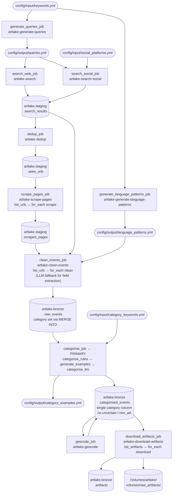

# ArtLake — Data Flow

End-to-end pipeline from keyword configuration to downloadable artifacts,
implemented as Databricks Workflows with `.whl` entry points.

---

## Pipeline Overview

---

## Step-by-Step Reference

### 1 — `generate_queries_job`

| | |
|---|---|
| Entry point | `artlake-generate-queries` |
| Input | `config/input/keywords.yml` |
| Output | `config/output/queries.yml` |
| Trigger | Once; re-run when `keywords.yml` changes |

Translates base English keywords to NL / DE / FR via LLM. Generates one search
query per `language × category × country` combination and writes them to
`queries.yml`, which is deployed as a DAB artifact.

---

### 2 — `generate_language_patterns_job`

| | |
|---|---|
| Entry point | `artlake-generate-language-patterns` |
| Input | `config/input/keywords.yml` |
| Output | `config/output/language_patterns.yml` |
| Trigger | Once; re-run when `keywords.yml` changes |

Generates multilingual field-label patterns (title, location) used by the
clean-events step for structured field extraction.

---

### 3 — `search_web_job` + `search_social_job`

| | |
|---|---|
| Entry points | `artlake-search`, `artlake-search-social` |
| Input | `config/output/queries.yml` (+ `social_platforms.yml` for social) |
| Output | `artlake.staging.search_results` |
| Run mode | Can run in parallel |

DuckDuckGo search for web results; site-scoped DuckDuckGo for social platforms
(Facebook, Instagram, LinkedIn). Both append to `search_results`.

---

### 4 — `dedup_job`

| | |
|---|---|
| Entry point | `artlake-dedup` |
| Input | `artlake.staging.search_results` |
| Output | `artlake.staging.seen_urls` |

Fingerprints each URL with `sha2(url, 256)` and anti-joins against `seen_urls`
to deduplicate across runs. Writes only new URLs to `seen_urls` (persistent
across pipeline runs).

---

### 5 — `scrape_pages_job`

| | |
|---|---|
| Entry point | `artlake-scrape-pages` |
| Input | `artlake.staging.seen_urls`, `artlake.staging.scraped_pages` |
| Output | `artlake.staging.scraped_pages` |
| Tasks | `list_urls` → `for_each` scrape (concurrency 10) |

`list_urls` anti-joins `seen_urls` against `scraped_pages` and emits unseen
URLs as a Databricks task value. Each `for_each` worker fetches one URL: checks
`robots.txt`, tries `llms.txt`, falls back to BeautifulSoup HTML parsing.
Stores raw content only (title, body, hrefs, artifact_urls).

---

### 6 — `clean_events_job`

| | |
|---|---|
| Entry point | `artlake-clean-events` |
| Input | `artlake.staging.scraped_pages`, `artlake.staging.search_results`, `language_patterns.yml` |
| Output | `artlake.bronze.raw_events` |
| Tasks | `generate_language_patterns` → `list_urls` → `for_each` clean (concurrency 10) |

Parses dates, normalises fields via rule-based extraction using multilingual
patterns; falls back to LLM (`databricks-meta-llama-3-3-70b-instruct`) when
rules fail. Writes one `CleanEvent` per page. The `category` column is `NULL`
at this stage — populated by the next step.

---

### 7 — `categorise_job`  ← **Primary pipeline step**

| | |
|---|---|
| Entry points | `artlake-categorise-rules`, `artlake-generate-category-examples`, `artlake-categorise-llm` |
| Input | `artlake.bronze.raw_events`, `config/input/category_keywords.yml` |
| Output | `config/output/category_examples.yml`, `artlake.bronze.categorised_events` |
| Tasks | `generate_category_examples` (setup, parallel) + `categorise_rules` → `categorise_llm` |

Three tasks — `generate_category_examples` runs at job startup in parallel with
`generate_queries`; `categorise_rules` and `categorise_llm` both wait for it:

1. **`generate_category_examples`** *(setup phase)* — calls LLM to generate 2
   realistic event texts per `(category, language)` pair. Cached: skips LLM
   calls if `category_examples.yml` already exists (`overwrite=False`). Runs
   in parallel with `generate_queries` — no dependency on any table.

2. **`categorise_rules`** — keyword matching on `title + description`. Updates
   `category` in `raw_events` via `MERGE INTO`. Possible values:
   `open_call`, `exhibition`, `workshop`, `market`, `non_art`, `uncertain`.

3. **`categorise_llm`** — reads only `uncertain` events from `raw_events`,
   classifies them via mini-batched parallel LLM calls (batch size 10,
   `ThreadPoolExecutor`). Merges resolved events with rule-categorised events
   and writes `categorised_events`. Output has a single `category` column —
   no `uncertain` or `non_art` rows.

#### Test / comparison mode (`categorise_llm_job`)

Triggered manually via the **`categorise-llm-test`** job (never part of the
primary pipeline). Runs LLM on **all** events and writes two columns:

| Column | Value |
|---|---|
| `category` | Rule-based result (may include `uncertain`) |
| `category_llm` | LLM result on raw text, always definitive |

Used to audit rule vs LLM agreement at scale before promoting LLM as the
primary categoriser. Activated via `--llm-categorization-test` flag.

---

### 8 — `geocode_job`

| | |
|---|---|
| Entry point | `artlake-geocode` |
| Input | `artlake.bronze.categorised_events` |
| Output | `artlake.bronze.categorised_events` (overwrites with lat/lng + country filter) |

Resolves location text → lat/lng/country via Nominatim. Keeps only events in
target countries (`NL`, `BE`, `DE`, `FR`). Lat/lng stored for Phase 3
interactive radius filtering in BI dashboards.

---

### 9 — `download_artifacts_job`

| | |
|---|---|
| Entry point | `artlake-download-artifacts` |
| Input | `artlake.bronze.categorised_events` (reads `artifact_urls`) |
| Output | `artlake.bronze.artifacts`, `/Volumes/artlake/volumes/raw_artifacts/` |
| Tasks | `list_artifacts` → `for_each` download (concurrency 5) |

`list_artifacts` emits artifact URLs as a task value. Each `for_each` worker
downloads one PDF or image to Unity Catalog Volumes and writes metadata to
`artlake.bronze.artifacts`.

---

## Delta Lake Table Map

| Layer | Table | Written by | Read by |
|---|---|---|---|
| Staging | `search_results` | `search_web`, `search_social` | `dedup`, `clean_events` |
| Staging | `seen_urls` | `dedup` | `scrape_pages` |
| Staging | `scraped_pages` | `scrape_pages` | `clean_events` |
| Bronze | `raw_events` | `clean_events` (insert), `categorise_rules` (MERGE INTO) | `categorise_llm` |
| Bronze | `categorised_events` | `categorise_llm` (overwrite) | `geocode`, `download_artifacts` |
| Bronze | `artifacts` | `download_artifacts` | downstream (Phase 3) |

---

## Configuration Files

| File | Type | Written by | Read by |
|---|---|---|---|
| `config/input/keywords.yml` | git-tracked | humans | `generate_queries`, `generate_language_patterns` |
| `config/input/category_keywords.yml` | git-tracked | humans | `categorise_rules`, `generate_category_examples` |
| `config/input/social_platforms.yml` | git-tracked | humans | `search_social` |
| `config/output/queries.yml` | generated | `generate_queries` | `search_web`, `search_social` |
| `config/output/language_patterns.yml` | generated | `generate_language_patterns` | `clean_events` |
| `config/output/category_examples.yml` | generated (cached) | `generate_category_examples` | `categorise_llm` |

All `config/output/` files are deployed to the Databricks workspace via DAB and
accessed at runtime through the `${var.config_root}` variable.
